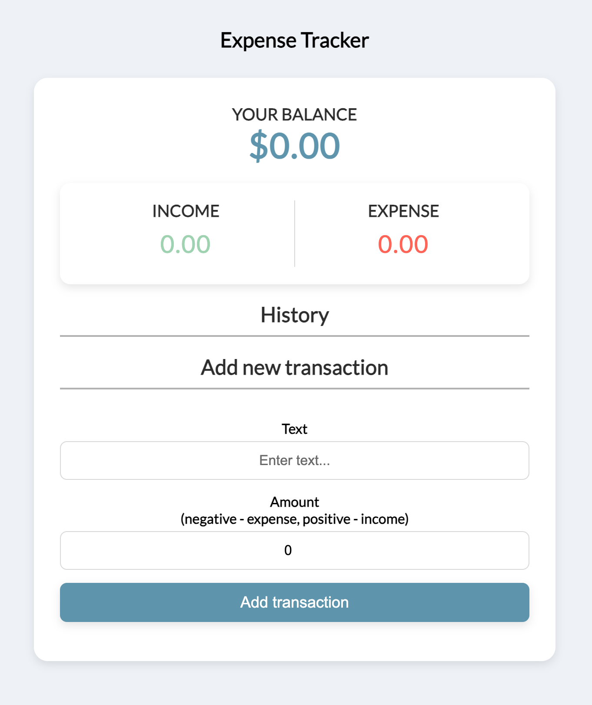

# Expenses Tracker Web App



This is a simple but effective web application built with React.js that allows users to track their expenses, categorized by type.

## Features

- **Input Form:**
    - Allows users to enter the expense name, amount, and category.
    - Handles input validation to ensure proper data entry.
- **Expense List:**
    - Dynamically displays the list of recorded expenses.
    - Presents expenses in a clear and concise format, including name, amount, and category.
- **Total Expenses:**
    - Calculates and displays the total sum of all expenses.
- **Categorization:**
    - Enables users to categorize expenses for better financial analysis.
    - Allows for customization of categories to suit individual needs.
- **Responsive Design:**
    - Adapts smoothly to different screen sizes, providing an optimal user experience across various devices.
- **User -Friendly Interface:**
    - Designed with simplicity and intuitiveness in mind, making it easy for users to navigate and track their finances.

## Technologies Used

- **React.js:** A JavaScript library for building user interfaces, providing a component-based architecture and efficient rendering.
- **HTML, CSS:** The foundation of web development, used for structuring and styling the application.
- **JavaScript:** Used for logic, data manipulation, and user interactions.

## Installation and Usage

1. **Clone the repository:**
    ```bash
    git clone https://github.com/hosssamalmaraghy/expenses-tracker-react.git
    ```
2. **Navigate to the project directory:**
    ```bash
    cd expenses-tracker-react
    ```
3. **Install dependencies:**
    ```bash
    npm install
    ```
4. **Start the development server:**
    ```bash
    npm start
    ```

## Customization and Extension

- **Add More Features:** Enhance the app by implementing advanced features like:
    - Expense charts and graphs for visualization.
    - Income tracking to provide a complete financial overview.
    - Budget planning capabilities.
- **Modify Styling:** Customize the look and feel of the application by adjusting the CSS styles to match your preferences or brand guidelines.
- **Add More Categories:** Expand the existing categories to include specific areas of spending.

## Acknowledgments

- Inspired by various expense tracking applications.
- Thanks to the React community for their continuous support and resources.
